<div align="center">

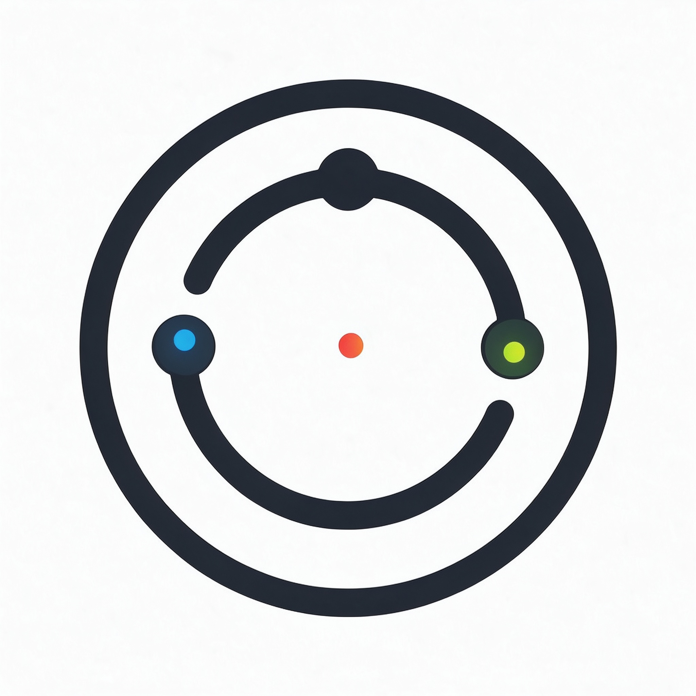

# DayLens · 每日镜

### 把电脑活动翻译成「今天真正做过的事」

[](LICENSE)
[](https://github.com/xueze-ai/daylens)
[](https://www.python.org/)
[](https://www.qt.io/)
[](https://github.com/xueze-ai/daylens/releases)
[](#参与贡献)

**简体中文** ｜ [English](README.en.md)

</div>

---

## 简介

**DayLens（每日镜）** 是一款**本地优先（local-first）**的 Windows 个人电脑活动复盘工具。它在后台持续记录前台软件使用时长、文件变化、浏览器访问概况、软件安装变化与微信接收文件，再把成千上万条底层记录合并成容易理解的一句话：**「今天做了什么」**。

它还能为你生成全天时间线、专注度评分、快照差异对比，以及由你自己的 AI 整理的中文每日复盘。

> DayLens **不是**录屏软件，也**不是**键盘记录器。它不会截屏、录音、记录键盘输入，也不会读取微信聊天内容。所有数据默认只保存在你自己的电脑上。

## 效果预览

### 核心功能总览（一）

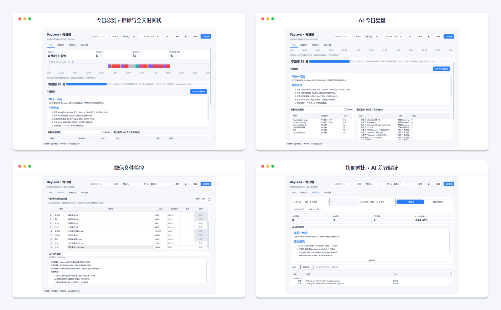

### 核心功能总览（二）

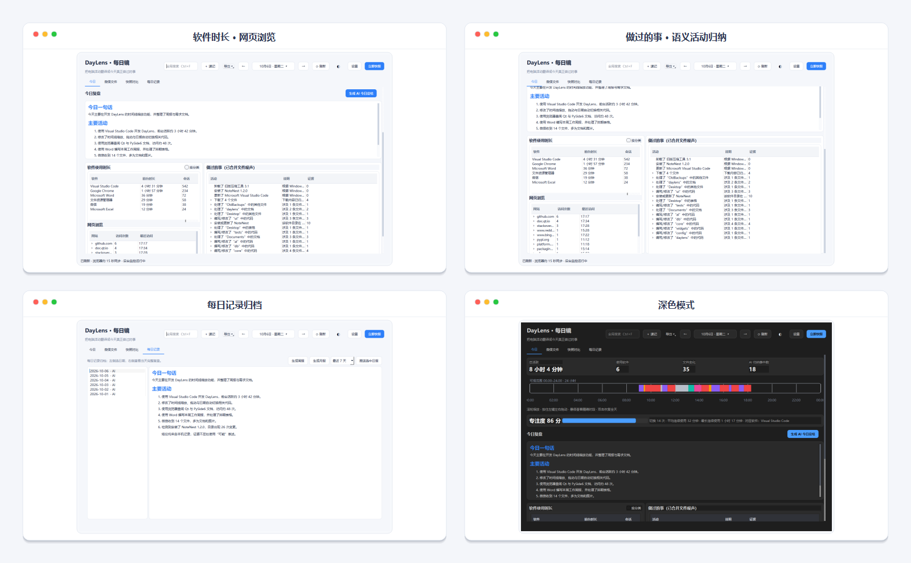

### 页面细节

**今日总览**：活跃时长、软件数量、文件变化、AI 归纳事件数一目了然，下方是 0–24 时全天时间线与专注度评分。

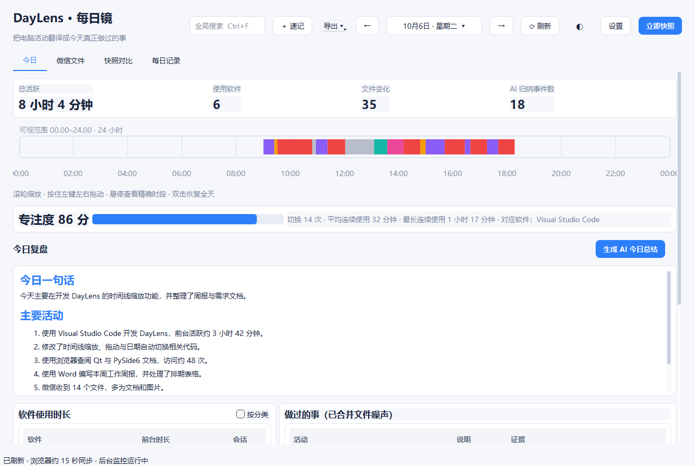

**AI 今日复盘**：把结构化证据整理成中文总结，每条结论都能在下方找到对应证据，不把「打开过」写成「已完成」。

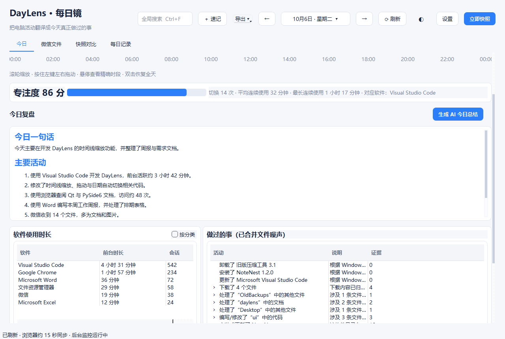

**软件使用时长与网页浏览**：按实际前台时长排序，网页按域名汇总访问次数，悬停/展开可查看页面标题。

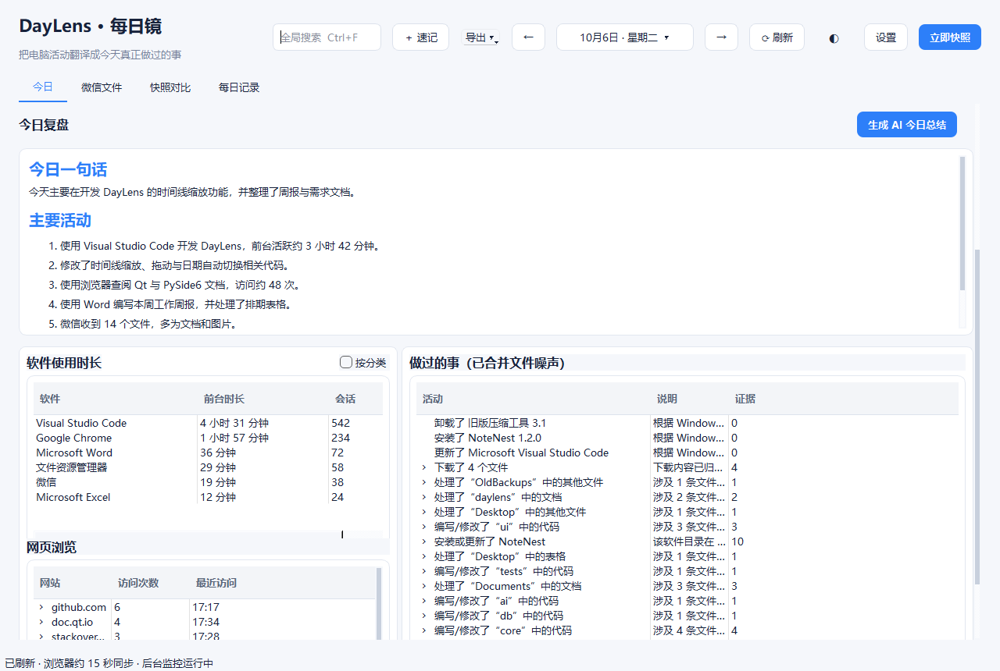

**做过的事**：同一项目、软件目录或下载目录的大量文件噪声被合并成一件事，并保留可展开的文件证据。

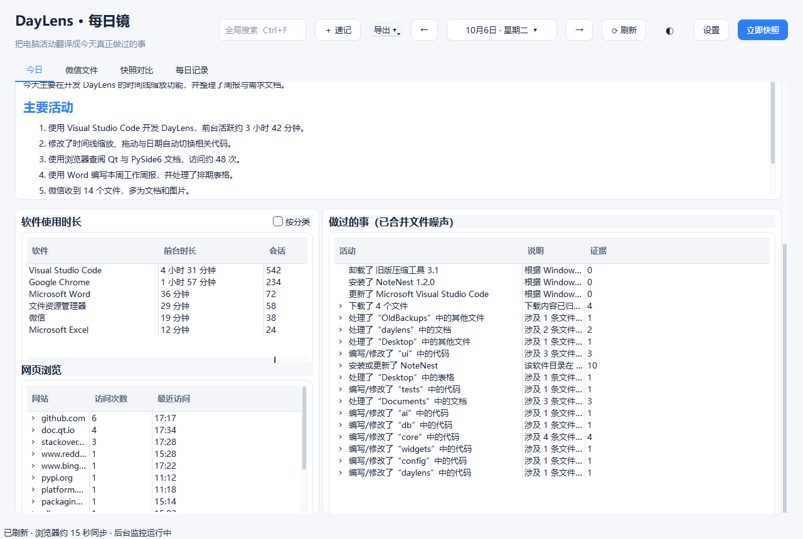

**今日整页**：一张图看全所有模块（可在窗口中滚动查看）。

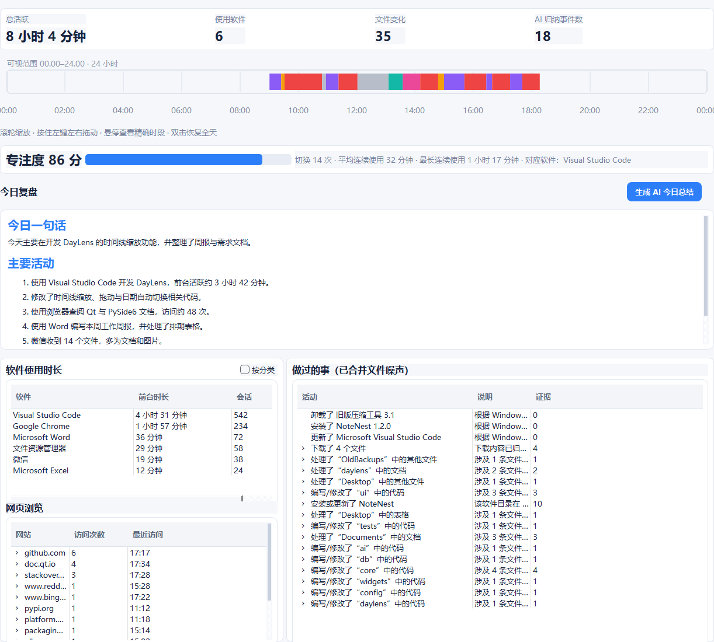

**微信文件**：按接收时间展示类型、大小与备注，支持类型筛选；配置 AI 后可对文档生成摘要。无法获取发送者与聊天内容，也不会伪造。

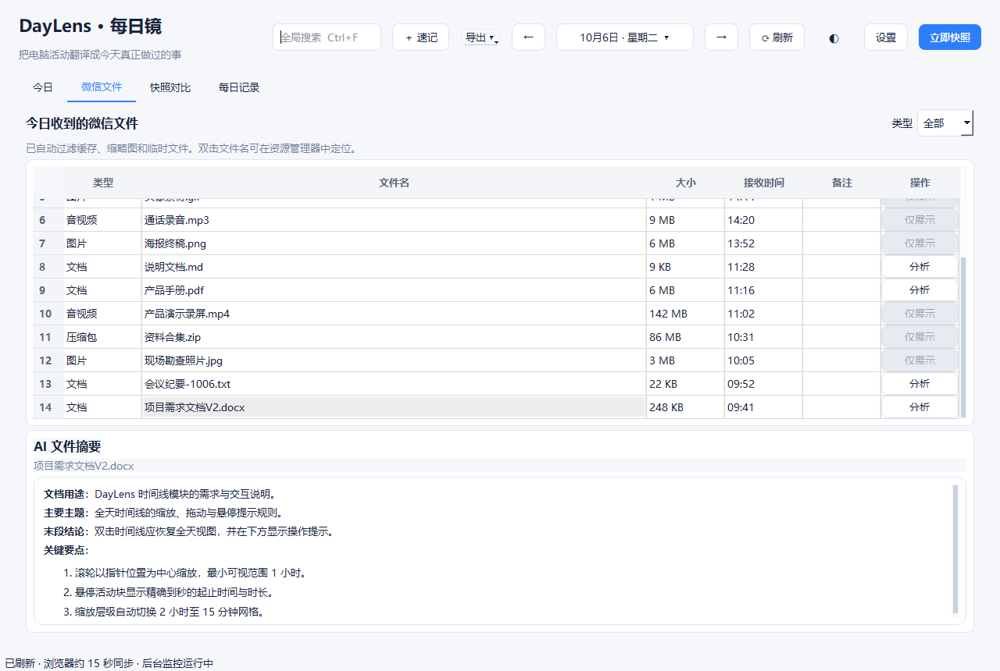

**快照对比**：比较两个时间点的新增、修改、删除与空间变化，支持动作、类型与路径筛选，并可让 AI 解读差异。

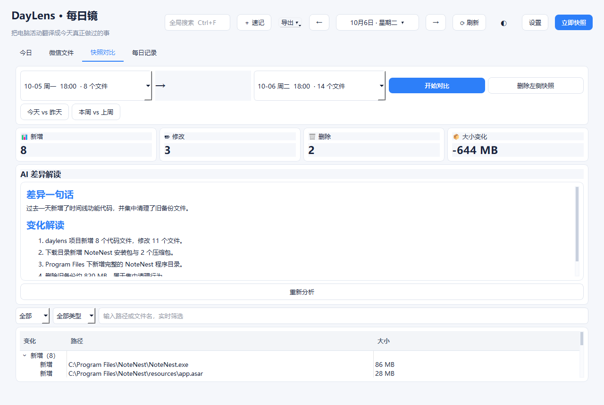

**每日记录**：按日期归档本地总结与 AI 总结，支持生成周报、月报，以及重新推送选中日期的日报。

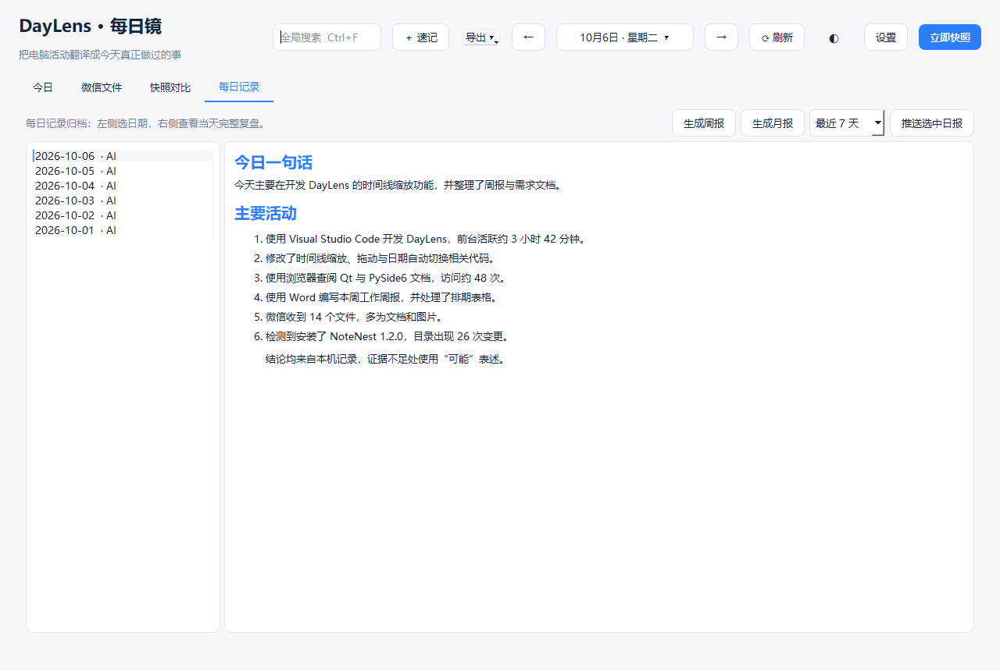

**AI 服务设置**：同时支持 OpenAI 兼容接口与本地 Ollama，连接测试在后台执行。

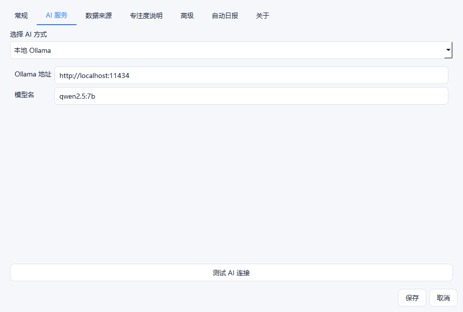

**关于页**：版本、作者、技术架构与数据原则清晰可查。

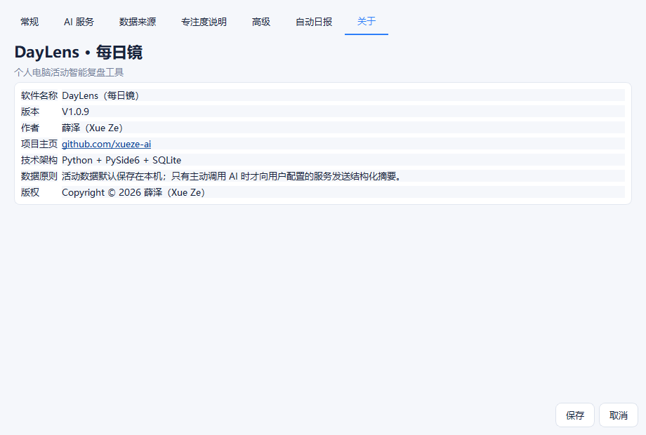

**深色模式**：主界面与设置均提供明亮 / 深色两套主题。

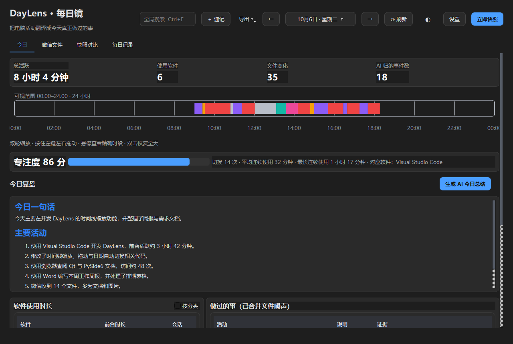

> 以上截图中的人名、文件名、网站与数据均为演示数据。

## 功能特性

- **软件使用时长**：每 5 秒采样当前前台窗口，连续使用自动合并为会话，统计真实前台时长。
- **文件变化监控**：基于 Windows 文件系统事件监控选定磁盘，事件批量写入 SQLite，没有 15,000 条上限。
- **语义活动归纳**：把同一项目、软件目录或下载目录的大量文件噪声合并成一件事。
- **软件安装识别**：对比 Windows 已安装软件清单，识别安装、更新与卸载。
- **浏览器历史概览**：读取 Chrome、Edge、Firefox 的本地历史，按域名汇总访问次数。
- **微信文件监控**：记录微信接收目录中的新文件，支持分类、备注与部分文档 AI 摘要。
- **全天时间线**：以 0–24 时色块展示软件会话与空闲时段，支持滚轮缩放、拖动与精确到秒的悬停提示。
- **专注度分析**：输出 0–100 分、切换次数、平均/最长连续使用时长。
- **自动 / 手动快照**：对比两个时间点的文件新增、修改、删除与空间变化。
- **AI 每日复盘**：支持任意 OpenAI 兼容接口或本地 Ollama，把结构化证据整理为中文总结。
- **自动日报**：可在指定时间生成总结，并选择通过 Server 酱推送到微信。
- **全局搜索与快速速记**：可搜索文件、微信文件、AI 总结与速记；`Ctrl+Alt+N` 快速记录想法。
- **明亮 / 深色主题、单实例运行**：重复双击不会创建多个监控进程，而会激活已有窗口。

## 快速开始

### 方式一：下载成品（推荐普通用户）

1. 前往 [Releases 页面](https://github.com/xueze-ai/daylens/releases)，下载最新的 `DayLens_vX.Y.Z-Windows-x64.zip`。
2. 解压后保留完整文件夹，双击其中的 `DayLens_vX.Y.Z.exe`（不要只复制 EXE，也不要移动 `_internal` 目录）。
3. 首次启动会创建本地配置与数据库，并开始记录此后的活动。
4. 关闭主窗口后程序驻留系统托盘；双击托盘图标重新打开，右键选择「退出」才会完全关闭。

**Windows SmartScreen 提示**：程序尚未购买商业代码签名证书，可能出现「Windows 已保护你的电脑」。确认来源为本项目后，点击「更多信息 → 仍要运行」即可。

### 方式二：从源码运行（推荐开发者）

环境要求：**Python 3.11**（Windows 10 / 11，64 位）。

```powershell
git clone https://github.com/xueze-ai/daylens.git
cd daylens/DayLens

# 可使用项目自带脚本创建虚拟环境（需要 uv）：
powershell -ExecutionPolicy Bypass -File .\setup-build.ps1

# 或手动创建：
python -m venv .venv
.\.venv\Scripts\Activate.ps1
pip install -r requirements.txt

# 启动
python main.py
```

### 方式三：自行打包 EXE

在 `DayLens` 目录激活虚拟环境后运行：

```powershell
.\build.bat
```

产物位于 `dist\DayLens_vX.Y.Z\`。带 Logo 打包时 PyInstaller 参数包含：

```text
--icon assets\logo.ico
--add-data "assets\logo.png;assets"
```

编译前请先从托盘退出正在运行的 DayLens，否则输出目录可能被占用。

## 首次使用建议

1. 在「设置 → 常规」中确认需要监控的磁盘。
2. 设置空闲判定时间，默认 5 分钟。
3. 在「设置 → 数据来源」中确认浏览器历史采集开关与微信文件目录；不用的功能可以关闭。
4. 需要 AI 总结时，在「设置 → AI 服务」中配置 OpenAI 兼容接口或本地 Ollama。
5. 保持程序运行一段时间，再查看软件时长、时间线与专注度。

软件使用时长从 DayLens 启动后开始累计，无法追溯安装之前的前台时长；浏览器历史与文件基线可以读取本机已有信息。

## 隐私与数据安全

配置、数据库与日志全部保存在本机：

```text
%APPDATA%\DayLens\config.json
%APPDATA%\DayLens\daylens.db
%APPDATA%\DayLens\logs\
```

**AI 会收到什么**：只有你主动生成总结时，程序才会向**你自己配置**的 AI 地址发送经过限制和预聚合的数据——软件名称与前台秒数、会话数、截断后的示例窗口标题、最多 60 个活动聚类、最多 10 个浏览器域名汇总、专注度与日期。

- 默认**不会**发送完整原始文件列表或文件内容。
- 只有主动点击微信文档的「分析」时，才读取并发送该文档文本（最多约 30,000 字符）；PDF 优先发送第一页与最后一页。
- 不配置 AI 也能完整使用软件时长、文件聚合、浏览器概览、快照与本地规则总结。
- 凭证保存在当前 Windows 用户的本地 JSON 中，请不要把 `config.json`、数据库或日志提交到公开仓库或发给他人。

## 工作原理

```text
前台窗口采样 ──→ 软件会话与使用时长 ─┐
文件系统事件 ──→ 项目/软件/下载聚类 ─┤
安装清单变化 ──→ 安装/更新/卸载事件 ─┤
浏览器历史 ────→ 网站域名汇总 ──────┤
微信接收目录 ──→ 文件类型与接收记录 ─┤
空闲检测 ──────→ 专注度与时间线 ─────┤
                                        ├─→ 本地规则总结
快照 A + 快照 B → 新增/修改/删除差异 ┘
                                        └─→ 用户主动调用 AI → 中文复盘
```

文件事件与采样先落库（SQLite，WAL 模式），界面查询时再去重、聚合与渲染；网络 AI 不是监控链路的必需部分。

## 常见问题

**打开很久仍没有软件时长？** 确认托盘中仍有 DayLens，点击「刷新」，正常使用几个软件至少一分钟；仍无数据时查看日志。

**网页浏览一直为空？** 确认浏览器历史采集已开启；无痕模式不保存历史，便携版或自定义用户目录可能无法识别。

**双击出现多个窗口？** 当前版本已限制单实例；若仍出现，通常是不同目录中的旧版与新版同时运行，请在任务管理器中确认 EXE 路径并退出旧版。

**AI 提示 401 / 请求很慢？** 401 表示 Key 无效、过期或不属于当前服务，请核对 API 地址、Key 与模型权限；响应速度取决于网络、服务负载或本地 Ollama 所在硬件。

**关闭窗口后为什么还在运行？** 关闭主窗口只是隐藏到托盘，后台监控继续；完全退出需右键托盘图标选择「退出」。

<details>
<summary><b>更多问题与已知限制</b></summary>

- 无法恢复安装 DayLens 之前的软件时长。
- 文件变化不能百分之百证明用户亲自完成了某项工作。
- 微信无法提供发送者、群聊名称或聊天内容。
- 受保护目录可能因权限不足无法读取或快照。
- AI 输出仅用于辅助复盘，不应作为审计或法律证据。

</details>

## 参与贡献

欢迎提交 Issue 与 Pull Request，让 DayLens 更好用：

1. Fork 本仓库并创建你的特性分支（`git checkout -b feature/awesome-feature`）。
2. 修改代码并确保通过基本检查。
3. 提交变更（`git commit -m "feat: add awesome feature"`）。
4. 推送分支并发起 Pull Request，描述清楚改动内容与原因。

提交 Bug 时请附上：系统版本、DayLens 版本、复现步骤与日志（注意先脱敏，不要贴出 API Key）。

## 路线图

- 更多浏览器（Brave、Opera、国产 Chromium 内核浏览器）的历史采集。
- 更丰富的时间线统计与导出样式。
- 可插拔的复盘模板与更多推送通道。

## 使用原则

请只在你有权使用和监控的电脑账户上运行 DayLens；在共享电脑环境中，请尊重其他使用者的知情权与隐私。

## 许可证

本项目基于 [MIT License](LICENSE) 开源。

<div align="center">

**DayLens · 每日镜** —— 看清每一天，把时间花在真正重要的事上。

</div>
